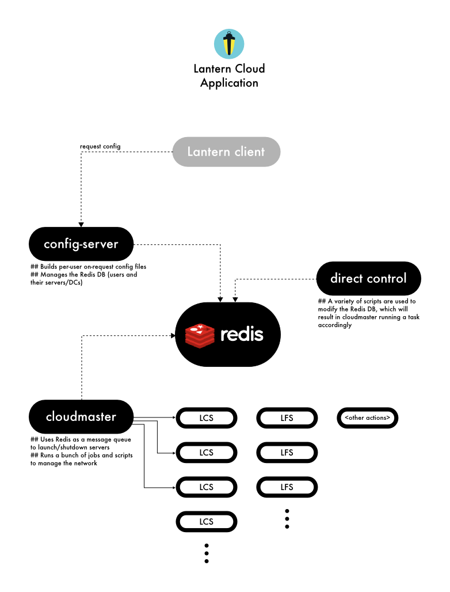

# Lantern Documentation for Developers

## Overview

Lantern is an HTTP/HTTPS proxy, comprised of a desktop/mobile application and a server ecosystem or *cloud*.  In this document, the main lines of operation in this architecture will be described.  Links are provided to more in-depth explanations where available.

## Lantern Core

**This concerns the project in this repository: [lantern](https://github.com/getlantern/lantern).**  This is the repository of the Lantern desktop application, but it also hosts some utilities and Go packages used elsewhere (see [Lantern Cloud](#lantern-cloud)).

Let's start by describing what happens when the user decides to download Lantern and use it:

1. First, recall that the user is probably not living in a country with free internet, and has to use an alternate method of grabbing a copy of the Lantern installer.  At this point, we've already touched two crucial processes of Lantern: installer generation and installer distribution. Installer generation is currently a manual process handled by Lantern [Makefile](https://github.com/getlantern/lantern/blob/valencia/Makefile) (see _package-*_ tasks).  Installer distribution is in flux, as better ways are proposed and implemented. But mainly, it is done via direct download from CDNs or Github, and in case these are blocked, the mail autoresponder (see [Lantern Cloud](#lantern-cloud)).

1. Once the user grabs a copy for any of the supported OSs (Linux, OS X, Windows, or mobile), it will be installed accordingly.  The packages are prepared for making this as easy as possible (see [installer resources](https://github.com/getlantern/lantern/tree/valencia/installer-resources)).

1. The first time the user runs Lantern, it will work with its embedded configuration.  This implies that the bootstrapping configuration is widely distributed, and can be used by censors to easily automate blocking as this information is openly provided to all users that download Lantern without distinction. The part that handles the generation of this embedded configuration is [genconfig](https://github.com/getlantern/lantern/tree/valencia/src/github.com/getlantern/flashlight/genconfig), which relies also upon some parts of Lantern Cloud, mainly for obtaining the updated list of servers that Lantern has deployed.

1. Lantern relies critically on the previous step. If it succeeds, that means it can use the embedded configuration to gain access to the free internet, via one of the different kinds of servers that Lantern has deployed.  But using this method as the only path to the free Internet from then on is problematic: if the censors have this information, it can be used easily block all Lantern users' access.  Thus, at this point, the Lantern client is ready to attempt to obtain a config that will make the whole Lantern network more resilient, without the limitations of the distribution channel used for the generic installer.  For this purpose, the Lantern client will try periodically to contact the [config-server](https://github.com/getlantern/config-server), whose responsibility is generating the configuration and maintaining the logic behind server assignations.

1. Once a more resilient and unique configuration is received (which will periodically be polled for updates), Lantern can use any of the types servers in the Lantern cloud (either *LCS* or *LFS* -- aka *fallbacks* or *chained servers* and *flashlight* or *fronted server*).  There are few techniques used by Lantern for proxying.  In a nutshell, Lantern will act as an HTTP/HTTPS proxy that will listen in a local port for requests.  These requests will be redirected in different ways to servers that will reach the open internet.  The servers can be peers (to be done!), or any the of Lantern-hosted servers mentioned before.  This is described below in more detail, as part of the Lantern Cloud project.

Concurrently to normal Lantern client operation, there are a few processes going on:

* Autoupdates: Lantern will periodically check for updates. See description of this process in [lantern client autoupdate](https://github.com/getlantern/lantern/tree/valencia/src/github.com/getlantern/autoupdate), and the [lantern autoupdate-server](https://github.com/getlantern/lantern/tree/valencia/src/github.com/getlantern/autoupdate-server).

* Config update requests (as described above).

### Key internal components

The most important pieces of the Lantern client application that are worth understanding are the networking packages:

* **balancer**: Provides weighted round-robin load balancing of network connections.  It can use either *chained* or *fronted* as available.

* **chained**: An implementation of proxy.Dialer that proxies traffic via an upstream server proxy. Its Dial function uses DialServer to dial the server proxy and then issues a CONNECT request to instruct the server to connect to the destination at the specified network and address.  It can be run as standalone HTTP server using Serve() or plugged into an existing HTTP server as an http.Handler.

* **fronted**: Provides a client and server for domain-fronted proxying using enproxy proxies

* **detour**: Detects if a site is potentially blocked or not.  Keeps temporary/permanent whitelists of blocked domains.  Provides a net.Conn interface to dial another dialer if a site fails to connect directly.  It maintains three states of a connection: initial, direct and detoured.

* **enproxy**: Provides an implementation of net.Conn that sends and receives data to/from a proxy using HTTP request/response pairs that encapsulate the data. This is useful when you need to tunnel arbitrary protocols over an HTTP proxy that doesn't support HTTP CONNECT. Content distribution networks are one example of such a proxy.

However, you will find many other modules in the application required for the proper user experience, such as the HTML-based UI and systray, logging, diagnostic helpers, local network discovery, and a large array of other support modules.

## Lantern Cloud

**This concerns the following projects:**

* **[lantern_aws](https://github.com/getlantern/lantern_aws)**: this is the central repository of DevOps operations in Lantern. It uses SaltStack for cloud orchestration and automation.
* **[config-server](https://github.com/getlantern/config-server)**: generates per-user on-request configs, among other things.
* **[sonar](https://github.com/getlantern/sonar)**: gathers connectivity data in different countries.
* **[statshub](https://github.com/getlantern/statshub)**: gathers global usage data.
* **[go-geoserve](https://github.com/getlantern/go-geoserve)**: service for geographic location discovery based on IPs.
* **[mail-autoresponder](https://github.com/getlantern/mail-responder)** (not deployed ATM).
* **[lantern-controller](https://github.com/getlantern/lantern-controller)** (superseeded by Redis DB).

Other parts of the cloud infrastructure are hosted within the main Lantern repository, such as (described below in the document):

* **[peerscanner](https://github.com/getlantern/lantern/tree/valencia/src/github.com/getlantern/peerscanner)**
* **[autoupdate-server](https://github.com/getlantern/autoupdate-server)**
* **[checkfallbacks](https://github.com/getlantern/lantern/tree/valencia/src/github.com/getlantern/checkfallbacks)**
* **[flashlight (in server mode)](https://github.com/getlantern/lantern/tree/valencia/src/github.com/getlantern/flashlight)**

### Server ecosystem

We've seen the user perspective of things, let's take a look, before explaning the different processes, at which servers and services run in the cloud.

The entity centralizing knowledge of the network is a Redis database, which is used by a variety of services for orchestrating the cloud and sending messages to each other with a decoupled architecture.  This database is managed mainly by [config-server](https://github.com/getlantern/config-server), automatically by [cloudmaster](https://github.com/getlantern/lantern_aws/tree/master/salt/cloudmaster) or by direct manipulation of the database (via a variety of scripts scattered in accordance with their uses).

There is also a number of services that are deployed as part of the same cloud as cloudmaster, separately in a PaaS (such as Heroku) or that are just an external API.  The mission of these servers is usually to provide a very specific service that will be used by any of the main actors depicted above (the Lantern client, the config-server and the cloudmaster).  The cloudmaster will generally take care of controlling/consuming some services for the proxy network health and monitoring, while other services are directly contacted by the Lantern client.

These are the different types of servers deployed by the **Salt cloud** and managed by the cloudmaster (see [top.sls salt file](https://github.com/getlantern/lantern_aws/blob/master/salt/top.sls)):

* The [cloudmaster](https://github.com/getlantern/lantern_aws/tree/master/salt/cloudmaster) itself.
* LCSs (chained or fallback servers, _fp-*_).
* [LFSs (fronted or flashlight servers, _fl-*_)](https://github.com/getlantern/lantern/tree/valencia/src/github.com/getlantern/flashlight/server).
* Waddell servers (not used at the moment).
* The [peerscanner](https://github.com/getlantern/lantern/tree/valencia/src/github.com/getlantern/peerscanner), which registers/unregisters *LFS* servers (aka *flashlight* servers) so they can be used by the Flashlight clients.  It basically adds/removes them from a Round-robin DNS in a CDN such as Cloudflare.
* The [autoupdates](https://github.com/getlantern/autoupdate-server) server, providing the automatic updates service.

These reflect the Salt-orchestrated cloud. There is also a **Legacy cloud** that still works but its services are slowly becoming irrelevant. This comprises the following:

* The Lantern Controller: a Google App Engine controller that was used primarly for launching new instances.
* An Amazon SQS queue service for receving messages in a distributed manner.  Now superseeded by Redis acting as a queue (see [redisq.py](https://github.com/getlantern/lantern_aws/blob/master/lib/redisq.py) implementation).

Finally, there are servers that live **outside the managed cloud**, which need to be controlled separately:

* The [config-server](https://github.com/getlantern/config-server) (in Heroku), described earlier on.
* The [statshub](https://github.com/getlantern/statshub) (in Heroku), used for collecting statistics for monitoring.
* A [go-geoserve](https://github.com/getlantern/go-geoserve) server (in Heroku), used for geographic location of IPs.
* [Loggly](https://www.loggly.com/), a service accessed through an HTTP RESTful API, used for logging.

### Cloud application

Let's take a look now at the Lantern cloud application, which refers to the ecosystem of processes running in the cloud resulting in an orchestrated service seen by the Lantern client as a single server (or set of servers) providing connectivity to the free internet.

The main concerns of the _distributed application_ are:

* Assigning servers to Lantern client instances.
* Creating/destroying servers on demand and in response to network/server health.
* Managing all cloud services that make this possible.

Let's continue at the point a Lantern client requests a config file to the config-server:

1. The Redis DB represents the live servers in the Lantern Cloud, as well as the pending actions to be executed with them.  This is filled by direct admin manipulation, or by the config-server manipulating the queues in the database.  Hence, launching a new server can be done in any of these ways.

1. When a new action is to be performed in the cloud, a message will be left in Redis for cloudmaster to pick it up and execute the action.  Different scripts will handle different actions (look into cloudmaster's [salt definitions](https://github.com/getlantern/lantern_aws/tree/master/salt/cloudmaster)) for services associated to actions, such as [refill_srvq.py](https://github.com/getlantern/lantern_aws/blob/master/salt/cloudmaster/refill_srvq.py) or [retire.py](https://github.com/getlantern/lantern_aws/blob/master/salt/cloudmaster/retire.py).

1. When the Lantern client requests a new config to the config-server, it will check if there is an actual need to send an update (otherwise will reply with *304 Not Modified*).  If it chooses to proceed, it will hit the Redis DB and build a configuration specifically for the requester Lantern instance. The internals of the Redis DB schema and how the config-server manages it are best described in [the comments section of redis.clj](https://github.com/getlantern/config-server/blob/master/src/lantern_config/redis.clj).  In essence, it will assemble a YAML config from portions stored as values in the database, according to a specific server/IPs distribution.

1. When a server needs to be removed, cloudmaster will execute the action.  Retiring a server basically involves deleting its entries in the `cfgbysrv` Redis hash table and adding a different job to delete it an hour later.

1. Each server in the Salt cloud usually runs a set of jobs, either periodically or triggered by an event.  The place to look for this is [the salt configuration files](https://github.com/getlantern/lantern_aws/tree/master/salt), and look into each of the directories for the particular server types.

## Lantern Mobile

**This concerns the project in this repository: [lantern-mobile](https://github.com/getlantern/lantern-mobile).**

Although it is hosted as part of [lantern](https://github.com/getlantern/lantern), it can be considered a separate project within Lantern due to its importance and the particularities of the mobile operating systems.

**TO BE DONE**
