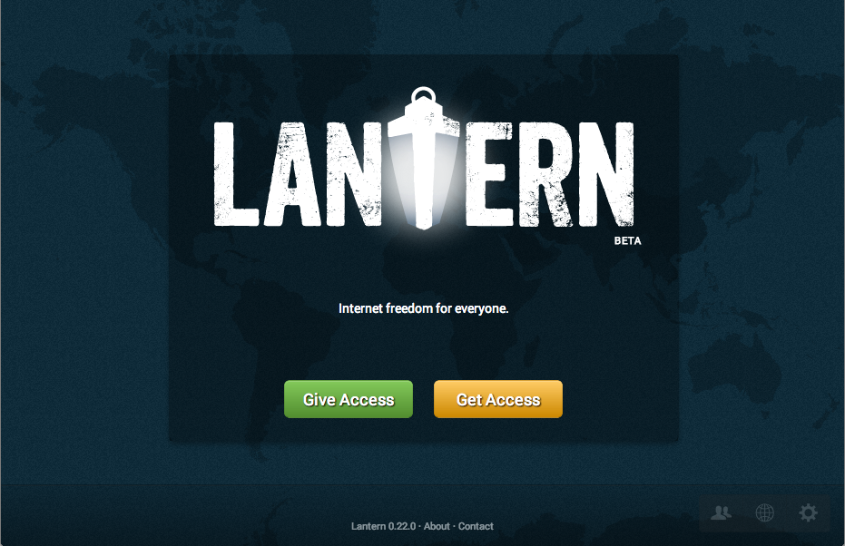

# lantern-ui

UI for [Lantern](https://github.com/getlantern/lantern).

A live demo is deployed to http://lantern-ui.jit.su/app/index.html running
against the bundled mock server, which simulates a real Lantern backend.
The real backend serves lantern-ui only over localhost, where minification,
concatenation, and other speedups appropriate for remotely hosted files are not
necessary. Please keep that in mind when accessing the public demo.

## Overview

This is the repository for the UI of
[Lantern](https://github.com/getlantern/lantern). It is maintained as
a separate repository to facilitate development. This code can be run
independently of Lantern's Java backend with a lightweight node.js http server
using [Faye](http://faye.jcoglan.com/) to implement Lantern's bayeux server.

See [SPECS.md](https://github.com/getlantern/lantern-ui/blob/master/SPECS.md)
for specifications of the state and the state transitions developed for the
UI (work in progress).

## Getting Started

Install required dependencies (`sudo` as necessary):

* [Node.js](http://nodejs.org/): `brew install node` or equivalent for your
  system

* [Bower](http://bower.io): `npm install -g bower`

* Then run `bower install` from the repo root

For working on the stylesheets:

* [ruby](http://www.ruby-lang.org/) (comes with OS X)

* [compass](http://compass-style.org/) 0.12.2:
  `gem install compass --version '= 0.12.2'`.
  
Tell compass to watch for changes in the sass stylesheets and
automatically compile them into css in the directory specified by the compass
config file (`config/compass.rb`):

    $ scripts/start-compass.sh &
    >>> Compass is watching for changes. Press Ctrl-C to Stop.

Start up the Node.js mock server simulating the Lantern backend:

    $ scripts/web-server.js
    Bayeux-attached http server running at...

The UI should now be available at
[http://localhost:8000/app/index.html](http://localhost:8000/app/index.html)

To skip the setup process and go straight to an already set up instance, run:

    $ scripts/web-server.js --skip-setup

You should then see something like this when you load the app:

## Running tests

Globally install required Node.js packages (`sudo` as necessary):

    npm install -g karma

Check out `.travis.yml` and referenced files for examples of running the
unit tests and end-to-end tests.

**TODO**: *expand this*

## Further Reading

The UI is implemented as an [AngularJS](http://angularjs.org) app. Using the
[AngularJS Batarang](https://github.com/angular/angularjs-batarang)
Chrome extension (especially the performance tab) is highly recommended for
development. As recommended, this repo was started with the
[angular-seed](https://github.com/angular/angular-seed). The
`scripts/web-server.js` script has been modified to attach a bayeux server
and a work-in-progress http API to simulate the Lantern backend.

[Specs](https://github.com/getlantern/lantern-ui/blob/master/SPECS.md) are
currently being developed to represent the full state of the application at any
given time, as well as transitions between states. The specs are being
developed in parallel to the UI and are currently changing frequently to
meet its needs.
