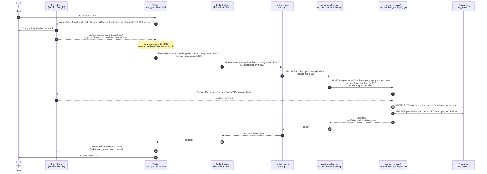
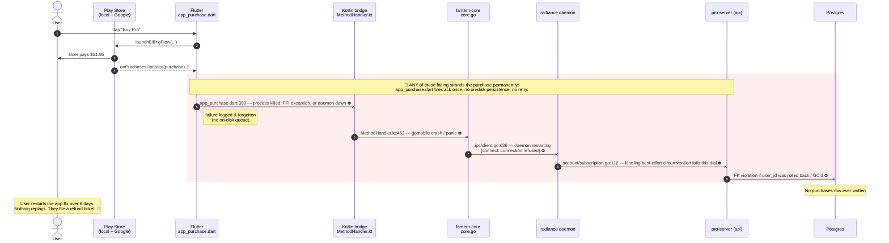
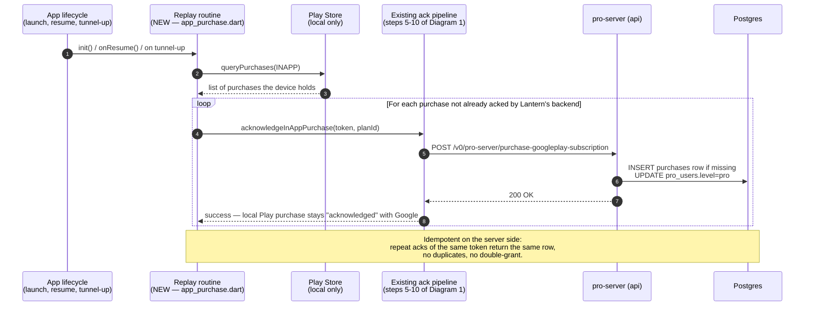

# Google Play purchase flow (Android, v9.x)

How an in-app purchase made on Google Play is supposed to make its way from
the user's tap to a row in `pro_server.purchases` — and where it currently
falls down when any single link in that chain fails.

This document covers the Android Google Play path only. iOS StoreKit and
Shepherd (AliPay/WeChat) have separate flows.

## Layers involved

| Layer | Purpose | Repo | Entry point |
|---|---|---|---|
| **Play Store** (local) | Charges the user's Google account, holds a record of the purchase on-device and on Google's servers | (Google) | `BillingClient` |
| **Flutter UI** | Initiates the purchase, listens for `BillingClient` callbacks, forwards the receipt to the ack pipeline | `getlantern/lantern` | `lib/features/plans/provider/payment_notifier.dart`, `lib/core/services/app_purchase.dart` |
| **Kotlin bridge** | Translates Flutter method-channel calls to gomobile FFI | `getlantern/lantern` | `android/app/src/main/kotlin/org/getlantern/lantern/handler/MethodHandler.kt` |
| **lantern-core** | Gomobile-exposed Go layer; forwards the ack to the radiance daemon over IPC | `getlantern/lantern-core` | `core.go:860` |
| **radiance daemon** | Local long-running process; speaks HTTP through kindling to Lantern's backend | `getlantern/radiance` | `ipc/client.go:636`, `backend/radiance.go:1132`, `account/subscription.go:112` |
| **pro-server** (HTTP API) | Receives the ack, verifies the token with Google, writes the entitlement | `getlantern/lantern-cloud` | `cmd/api/pro-server/handlers/subscription_gooleplay.go` |
| **Postgres** | `pro_server.purchases` + `pro_users.level` | `lantern-cloud` Cloud SQL | n/a |

## 1. Happy path — what's supposed to happen

Every link is single-shot. **There is no on-disk retry queue between steps 4 and 10**, and there is **no recovery mechanism** if the chain breaks anywhere in there.

## 2. What goes wrong in practice (today)

This is the failure pattern we've seen on multiple v9.1.x "paid but not upgraded" tickets (engineering#3464, support 173542, 173795, 174378/174862).

**Forensic signature of this failure** (from ticket 174862):

- Google Play `orders_get` shows the purchase as `PROCESSED`, `ACKNOWLEDGED`, `CONSUMED`.
- `pro_server.purchases` has **zero rows** for the purchase token.
- SigNoz: **zero log lines** mention the purchase token, the user_id, or `/v0/pro-server/purchase-googleplay-subscription` for that user over a 14-day window.
- The device IS communicating with the backend (datacap polling succeeds). So the device is not network-isolated; the ack call specifically didn't land.

We can't tell from the evidence whether the call was never made (steps 4-7) or made and failed at kindling (step 8). Both fit the data, and **both are bugs we have no recovery for**. The mitigation has to assume either failure mode.

## 3. The fix — startup-replay via `BillingClient.queryPurchases()`

Google's documented recovery pattern for *exactly* this case. `BillingClient.queryPurchases()` is a **local-only** call — it asks the on-device Play Store service "what purchases does this Google account hold against this app that haven't been acknowledged/consumed yet?" — no network, no auth, no Lantern backend involvement. The Play Store returns the list (including any that we failed to ack previously) and we re-fire the existing pipeline against each one.

Key properties of this fix:

- **Local-only on the client side.** No call to Lantern's backend in step 2; no call to Google's servers from our app. Just Play Store IPC, which is always available when the Play Store is installed.
- **Idempotent on the server side.** `pro_server.purchases.purchase_token` is `UNIQUE` (`purchases_purchase_token_key`); duplicate inserts no-op cleanly. So replaying a purchase that already landed is safe.
- **Fires at three lifecycle moments**: app launch (`init()`), foreground resume (`onResume`), and successful tunnel-up. Each gives the next chance to recover.
- **Doesn't require user action.** Today's `restorePurchases()` works the same way but only fires on a manual "Restore" tap — most affected users never find that button before filing a support ticket.

## Where this connects to the existing code

The lantern repo already has `restorePurchases()` at `lib/core/services/app_purchase.dart:198` that wraps `_inAppPurchase.restorePurchases()` (the `in_app_purchase` plugin's wrapper around `BillingClient.queryPurchases`). The existing call:

- Sets `_isRestoreFlow = true` and shows "restore" UI feedback to the user
- Only fires when the user explicitly taps "Restore" in the settings screen

The minimal change for action item #2:

- Add a `_replayPendingAcks()` method that does the same internal work as `restorePurchases()` but without setting `_isRestoreFlow` (so it's silent — no UI banner saying "restoring" on every app launch).
- Call `_replayPendingAcks()` at the end of `init()` (after the purchase stream is wired up so any deferred-purchase signals are routed correctly).
- Also call it on a `WidgetsBindingObserver.didChangeAppLifecycleState(AppLifecycleState.resumed)` listener.
- Optionally also call it from a hook fired when the radiance daemon reports tunnel-up.

The server-side endpoint already handles replays correctly (`purchase_token` is unique-constrained; the handler updates user level if the purchase row already exists but level wasn't yet bumped).

## Open follow-ups

- **Action item #1** (engineering#3464): on-disk retry queue for the original ack moment. Catches the case where step 4 in Diagram 2 fails before `queryPurchases` would have a chance to see the unack'd purchase. Strict superset of #2 in coverage but bigger surface; #2 is the fast fix.
- **Action item #3** (engineering#3464): server-side RTDN handler for one-time products. Belt-and-braces fallback for cases where the client never has another chance to call `queryPurchases` (uninstall before retry, etc.).
- **Action item #4** (engineering#3464): re-bind tool for stranded purchases where the `obfuscatedExternalProfileId` user_id no longer exists in `pro_users`. Required for the long tail and the broader v9.1.x "Pro lost on upgrade" pattern.

## References

- Engineering issue: [getlantern/engineering#3464](https://github.com/getlantern/engineering/issues/3464)
- Google's documentation on `queryPurchases` for recovery: <https://developer.android.com/google/play/billing/integrate#process>
- Server-side handler: `getlantern/lantern-cloud` `cmd/api/pro-server/handlers/subscription_gooleplay.go`
- Client transport (kindling): `getlantern/radiance` `kindling/client.go`
