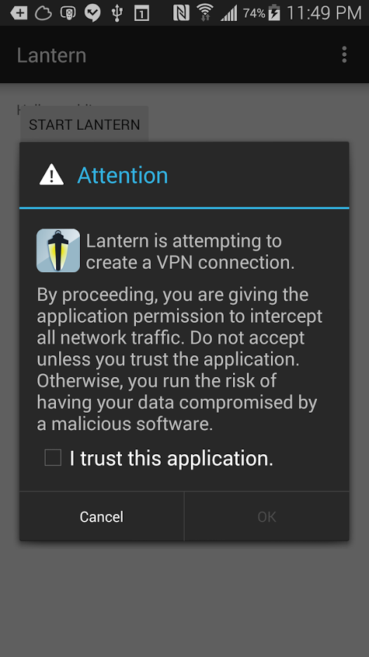

# Lantern Android

## Overview



Lantern Android is an App that uses the Android VpnService API to route all
device traffic through a packet interception service and subsequently the
Lantern circumvention tool.

## Building Lantern Android

Before building make sure you've compiled the Lantern proxy for Android:

```
cd $GOPATH/src/github.com/getlantern/lantern
make android-lib
```

### Building from Android Studio

#### Prerequisites

* [Android Studio][1]
* Git
* [Android NDK][2]

Download the most recent copy of the Lantern Android source code using `git`:

```
mkdir -p ~/AndroidstudioProjects
cd ~/AndroidstudioProjects
git clone https://github.com/getlantern/lantern-mobile.git
```

In the welcome screen choose the "Open an existing Android Studio" option and
select the `lantern` folder you just checked out with git.

### Building from the Command Line (beta, for development only)

#### Prerequisites

* Java Development Kit 1.7
* Git
* [Android NDK][2]

#### Building `tun2socks`

Lantern Android uses [tun2socks][3] to route intercepted VPN traffic through a
local SOCKS server.

```
make build-tun2socks
```

#### Building, installing and running

Build the Debug target:

```
make build-debug
```

Install it:

```
make install
```

Run the app on the device from the command line:

```
make run
```

By default, all three tasks will be run in order with:

```
make
```

#### Testing the app

#### Debugging

With Lantern Android running, to filter Logcat messages:

```
make logcat
```

#### Simulating tun2socks and lantern outside Android

We are going to use a virtual machine to simulate the `device <-> tun <->
tun2sock <-> lantern <-> Internet` dance.

```
cd /path/to/lantern-mobile
vagrant up
```

[1]: http://developer.android.com/tools/studio/index.html
[2]: https://developer.android.com/ndk/downloads/index.html#download
[3]: https://code.google.com/p/badvpn/wiki/tun2socks
